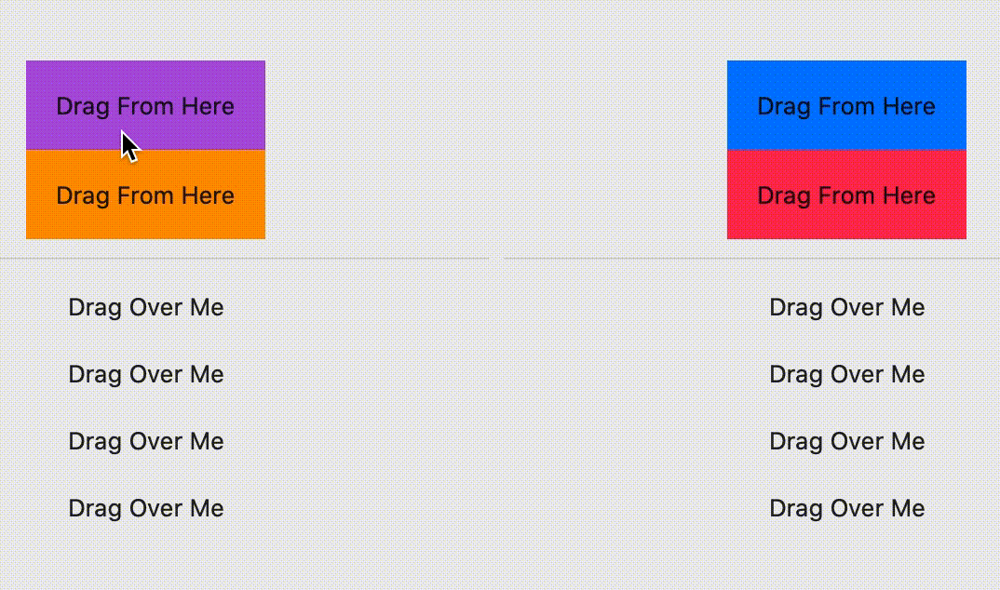

# SwiftUI Dragging and Dropping Colors
This is a simple demonstration of dragging and dropping colors to set the background colors for views.
 
 

-------------------
Usage:
Drag to cell, then click cell after drop to keep the color there. No click will not keep.

